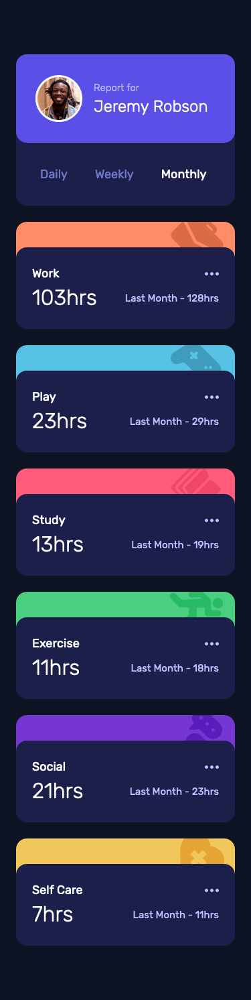
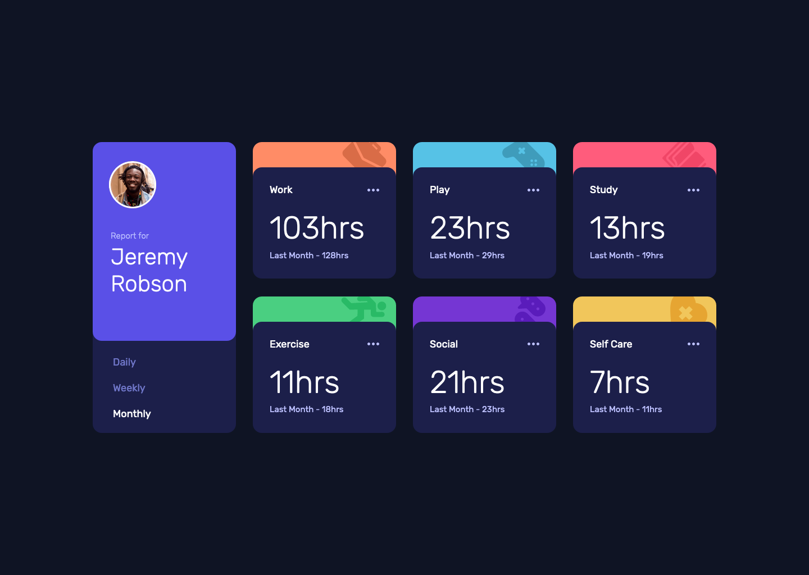

# Frontend Mentor - Time Tracking Dashboard Solution

This is a solution to the [Time Tracking Dashboard challenge on Frontend Mentor](https://www.frontendmentor.io/challenges/time-tracking-dashboard-UIQ7167Jw). Frontend Mentor challenges help you improve your coding skills by building realistic projects. 

## The challenge

Users should be able to:

- View the optimal layout for the site depending on their device's screen size
- See hover states for all interactive elements on the page
- Switch between viewing Daily, Weekly, and Monthly stats

## Screenshot

### Mobile


### Desktop


## Built with

- Semantic HTML5 markup
- Flexbox
- CSS Grid
- SASS
- BEM
- Mobile-first workflow
- JavaScript

## What I learned

I used `fetch()` to fetch the data from the json file and work with it in the JavaScript file. I think I attempted this project before but copied all the json data into the JavaScript file because I didn't know about `fetch()`.

As I've been using a lot of jQuery recently, I decided to go back to vanilla JavaScript for this project. I am pleased with the JavaScript code, particularly the 'for' loop which loops through the cards and adds the data for each card from the json file, depending on the index and which periodicity is selected.

```js
 function updateStats() {
            for (let i = 0; i < CARDS.length; i++) {
                CARDS[i].querySelector('.card__subject').textContent = data[i].title;
                CARDS[i].querySelector('.sr-only').textContent = currentText;
                CARDS[i].querySelector('.card__current-week--figure').textContent = data[i].timeframes[periodicity].current + 'hrs';
                CARDS[i].querySelector('.card__previous').textContent = previousText + data[i].timeframes[periodicity].previous + 'hrs';
            }
        }
```

## Continued development

I've always found objects in JavaScript quite difficult to understand for some reason, so I want to try some more projects that require pulling data from objects in an external json file. This project was a fairly simple introduction I think, so maybe I'll pick something a little more challenging.

## Useful resources

- [JavaScript Tip: Using fetch to Load a JSON File](https://www.youtube.com/watch?v=1tVCwv_BX2M) - How to use 'fetch()' to get the data from the json file